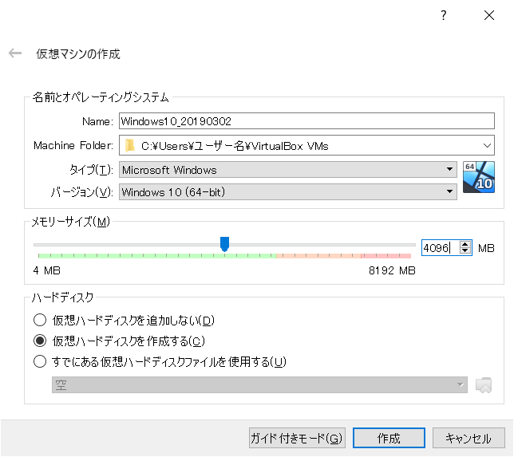
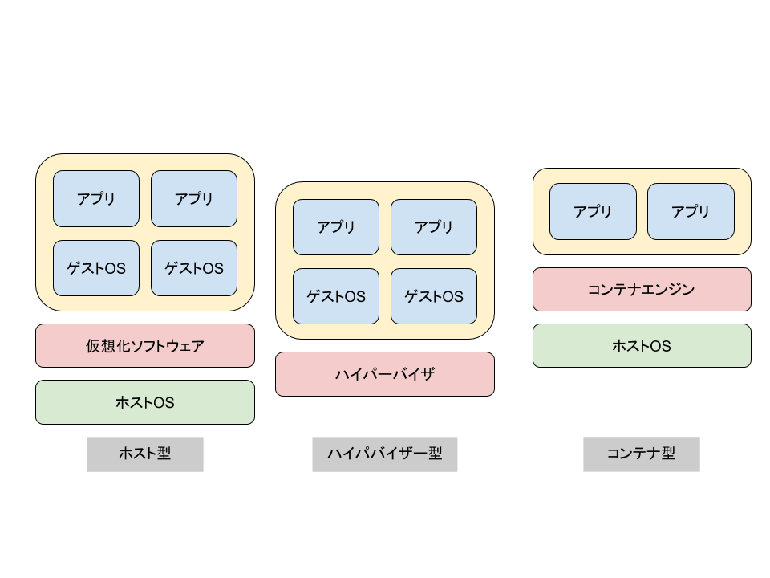

<!-- 
$size: 16:9
$theme: gaia
page_number: true
paginate: true 
-->

# 勉強会
   
**Docker編** ~基本的な概要や使い方からDBまで触れる~

--- 
   

# 自己紹介
   

- 氏名:うえ様
- 趣味:ゲーム
- 最近してること:ゲーム＆ゲーム
- Twitter:下に載せとるわ

---

# アジェンダ
 

1. 仮想化とは？
2. Dockerの利点
3. ハンズオン

---

# 仮想化とは？
仮想化（英語: virtualization）とは、コンピュータのリソースを抽象化することである。主にユーザーに提供するコンピュータそのものをハードウェアの詳細から切り離した状態でソフトウェア化する事を指す。

by [Wikipedia](https://ja.wikipedia.org/wiki/%E4%BB%AE%E6%83%B3%E5%8C%96)  

---

### つまり。。。
簡単にいうと、１つのpcであたかももう１つpcがあるように見せる技術。  
メリットとして、例えばmacOSでもWindowsOSを立てることができる。  
つまり、OS毎に〜用のpcなどの必要性がなくなる。  
とはいえ、スペックによって仮想化にも限界がある・・(仮想環境作る時に割り当てるメモリも自由に設定できる。  

---

# 仮想化の種類

---

### ホスト型
ホストOS(普段使ってるOS)上に仮想環境のソフトウェアをインストールして構築していく。
ホストOSの上にゲストOS(仮想化したもの)が乗っかる感じ。
- 有名なソフトウェア・・・Oracle VirtualBox, etc..

---

### ハイパバイザー型
１つのハードウェアにハイパバイザーと呼ばれる仮想化ソフトウェアを直接インストールし、仮想環境を作るタイプ。
OS自体に仮想環境の機能がついてるもの。
WindowsOSではWindows10 proのみ、Hyper-vという機能がある。
- 有名なソフトウェア(機能)・・・Hyper-v, etc..

---

### コンテナ型
ホストOSにコンテナエンジンの仮想化ソフトウェアをインストールし、その中でコンテナ環境を作りアプリケーションを実行する。コンテナは複数立てることができ、それぞれ**独立している**。
- 有名なソフトウェア・・・Docker

---

#### ホスト型とハイパバイザーの違い。
ホスト型の処理速度を改善したものがハイパバイザー。
ハイパーバイザ型は容量そのまま食うので注意。
 

#### ホスト型とコンテナ型の違い。
ホスト型は主にGUI操作が可能だが、コンテナ型は無理。
コンテナ型は最小の構成なので、言語のversion云々で環境作りたいときはこっちの方が良き。
OS丸ごといるわけじゃないので。

---

### Dockerはどういう時に使われるの？いいとこは？

##### 皆同じ環境で作業を行うことができる!
Dockerに関するファイルを共有するだけで同じ環境で作業することができます。

##### 言語のバージョンなどの競合がなくなる。
言語のバージョンでいうと、最近では*env系で管理するのが主流になりつつありますが、
一時的にあるバージョンを使用する場合などは、ホストOSを汚さずにすみます。
要するにバージョンがごちゃごちゃにならなくて良き。

---

##### 他にも。。。
- 軽量で速い
- 多数のコンテナを起動させることが可能
- *DockerHub*というGitでいうGitHubみたいなステーションがあり、
環境が整えるためのファイルが既に転がってる
- 開発環境をそのまま本番環境へ適応することもできる。

---

    
**では、そろそろ本題へ。。。**

---
## Dockerのインストール

 

- [docker](https://github.com/c-a-c/wordpress-theme.git) 

 

- [手順](https://qiita.com/astrsk_hori/items/a8bc8f3883d5b76c51d3)

---

## 用語などなど
- Dockerイメージ
  - OS・アプリの環境が記述されている。
- コンテナ
  - イメージをベースにした環境。
- Dockerfile
  - Dockerイメージ＋α(環境変数や追加パッケージなど)。
  追加したいものがある時に使用する。
  絶対ないとダメなものではない。

---

## Dockerのコマンド
- docker run ~
  - コンテナ起動
- docker exec ~
  - コンテナに接続
- docker images
  - 手元にあるイメージ一覧
- docker ps
  - 稼働中のコンテナを表示
---

- docker start ~
  - ~のコンテナを起動
- docker stop ~
  - ~のコンテナの終了

---

### まあとりあえず触ってみようや(step1)
 
ってことでハンズオン挟みます[c-a-c/summer_study_2020](https://github.com/c-a-c/Summer_study_2020)  

(作業環境はどのディレクトリでも構いません。)

CACのGitHub Organization入ってるかな？

`git clone https://github.com/c-a-c/Summer_study_2020.git`
してもろて。
ハンズオンの資料はREADMEに載せてるので、そっちみてやるよ〜!

---
   
 
**モクモク黙黙**

---

### step1終わり

 

いかがでしたでしょうか？
ちょっと難しいかも？
とはいえ、(今回はMySQLを)１から環境構築するよりかは全然時間がかからないはずです。

では次のステップへ！

---

### 問題点
 

先ほどのstep１では、MySQLを起動できたのはいいものの、何らかの理由でコンテナを消した時にデータが残らず、消えてしまいます。

そうならないために、**永続化**という作業を行います。

---

### マウント(mount)

と、その前にマウントの話をしないといけません。

Dockerでいうマウントとは、ホストOS側のファイルをゲストOS側で使えるようにする機能です。
要するにホストとゲストでファイルを共有できます。

---

### ということは。。。。
 

コンテナ内部で作成したデータベースなどがホスト側にも共有され、情報を残すことができます。

この概念を**永続化**と言います。

---

### マウントを使わないで共有する方法
もちろんあります。
コンテナ側からホスト側へ・ホスト側からコンテナ側へ、両方できます。
ex) `docker cp コンテナID:/hoge.txt purpose/`

ファイル１つ１つコピーするなんてナンセンスだし、面倒くさいよね。。。
(過去の私はマウントというものを知らなかったので、このコマンドを愛していました。)

---

### もう１つ新しいこと
コンテナの起動には`docker run ~`としていましたが、
`docker-compose`というコマンドで起動する方法もあります。

今回データベースの永続化にあたって、このコマンドを使用します。
このコマンドを使用するには`docker-compose.yml`が必要になります。

また、このファイルがある場所でしか起動できません。

---

### では、コンテナを消したらデータベースの情報が消えることを確かめましょう。(step2)

前述のcomposeファイルは頭の片隅に置いて置いてもろて、
とりあえず、データベースの情報が消えるのかをまず確かめてみます。

再びハンズオン(作業環境はどのディレクトリでも構いません。)

README.mdのstep2をご参照^^

---

### 確認できたので、続いてcomposeファイルで起動してみる。(step3)

最後のハンズオン--;

ディレクトリはcloneした`docker @ 79ead41/`で行います。

READMEのstep3を参照してくだされ。

---

### docker-composeの本当の使い方

composeコマンドは通常今回のハンズオンで使うのにあまり恩恵を受けていません。
本来の使い方はdocker runを複数する、即ち、複数のコンテナを立ち上げる際に、コマンド１つで立ち上げることができる場合に利用します。 (ex) PHPのコンテナとMySQLのコンテナを同時に立ち上げる。

docker runではオプションを多くつけすぎてわからなくなることも多いので、１つのコンテナを立ち上げるのにcomposeファイルを利用することもあります。(今回がそれ)
１番の利点は、複数のコンテナを１つのコマンドで立ち上げることができるということを頭の隅っこに入れておこう。

---

### step3終了

---

### まとめ

- Docker使うと簡単に環境を構築できる。

- コンテナはそれぞれ独立しているが、連携させることで１つのアプリとして使えるようになる。

---

###### 参考資料
- 仮想化
  - [aaa](https://www.kagoya.jp/howto/rentalserver/virtualization/)
  - [bbb](https://bcblog.sios.jp/what-is-virtualenvironment-vmware/)
- Dockerの永続化
  - [ccc](https://qiita.com/nobi_tum/items/0dd1ce7407e720338ea8)

---
     

**THANK YOU FOR LISTNING 😏**
